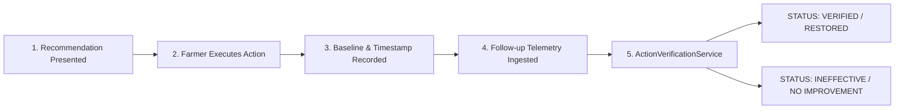

# AgriSense AI — Closed-Loop Action Verification Engine

## 1. Overview
The Closed-Loop Action Verification Engine (`ActionVerificationService.ts` and `ActionTracker.ts`) closes the loop between agronomic recommendations, farmer intervention execution, follow-up sensor measurements, and restoration verification.

---

## 2. Closed-Loop Action Lifecycle

---

## 3. Outcome Tracking States

- **`PRESENTED`**: Recommendation presented to user in Advisory view.
- **`ACTION_TAKEN`**: Farmer clicked "Execute Action", recording baseline value and timestamp (`executedAt`).
- **`VERIFIED`**: Post-action sensor reading restored target parameter to optimal range (e.g. soil moisture restored from 32% to 48%). Outcome status: `TARGET_RANGE_RESTORED`.
- **`INEFFECTIVE`**: Parameter showed no improvement after 2-hour observation window. Outcome status: `NO_IMPROVEMENT`.

---

## 4. REST API Endpoints

- **`POST /api/v1/public/actions/execute`**:
  - Request body: `{ recommendationId, fieldId, conditionCode, actionTitle, parameterName, baselineValue, unit }`
  - Creates closed-loop tracker entry with status `"ACTION_TAKEN"`.

- **`GET /api/v1/public/actions/closed-loop`**:
  - Evaluates pending actions against latest MongoDB telemetry. Returns verified outcome list.
