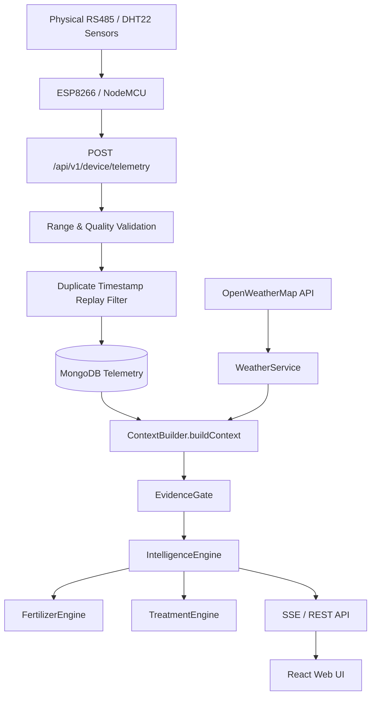

# AgriSense AI — Phase 2 Architecture & Implementation

## 1. Overview
Phase 2 turns AgriSense AI into a strictly **evidence-first, deterministic IoT agronomic intelligence system**. All UI visualizers, recommendations, and analytics rely solely on physical sensor telemetry, MongoDB state, and verified ICAR agronomic rules.

---

## 2. Key Architecture Additions

---

## 3. Core Modules Implemented in Phase 2

1. **EvidenceGate (`backend/src/services/IntelligenceEngine/EvidenceGate.ts`)**:
   - Inspects physical sensor measurements before evaluating condition rules.
   - Outputs `INSUFFICIENT_EVIDENCE` or `PARTIAL` when required parameters are missing or hardware is offline.

2. **FertilizerEngine (`backend/src/services/IntelligenceEngine/FertilizerEngine.ts`)**:
   - Evaluates NPK stoichiometry gaps against crop agronomic targets.
   - Calculates field-level dosage weight (kg Urea) based on exact field acreage from GIS.

3. **TreatmentEngine (`backend/src/services/IntelligenceEngine/TreatmentEngine.ts`)**:
   - Separates environmental risk detection (`RISK_DETECTED`) from confirmed plant disease (`CONFIRMED_DISEASE`).
   - Requires physical scouting confirmation before recommending chemical application. Attaches ICAR IPM extension citations.

4. **WeatherService (`backend/src/services/WeatherService/index.ts`)**:
   - Fetches live temperature, humidity, rainfall, and wind speed from OpenWeatherMap by field centroid.
   - Features 15-minute in-memory caching and graceful `UNAVAILABLE` fallback when API keys are unconfigured.

5. **Telemetry Quality & Replay Filter (`backend/src/controllers/TelemetryController.ts`)**:
   - Enforces strict range validation (e.g. soil moisture 0–100%, pH 0–14).
   - Flags out-of-bound readings as `INVALID` without zeroing valid sibling measurements.
   - Rejects duplicate `(deviceId, timestamp)` ingestion payloads with `409 Conflict`.

6. **Leaflet GIS Boundary Engine (`frontend/src/views/GIS/index.tsx`)**:
   - Interactive vertex drawing on Esri Satellite World Imagery map.
   - Real-time geodesic Hectare area and perimeter calculation.
   - Direct synchronization of GeoJSON boundaries to MongoDB.

---

## 4. Verification & Status
- **TypeScript Typecheck**: PASS (0 errors across `@agrisense/shared`, `@agrisense/backend`, `@agrisense/frontend`).
- **Jest Unit Test Suite**: PASS (38/38 unit tests passing across 13 test suites).
